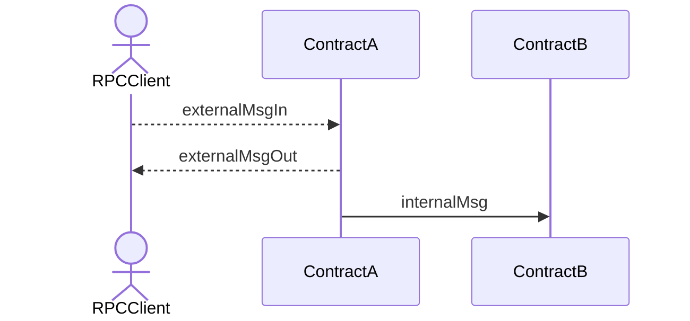
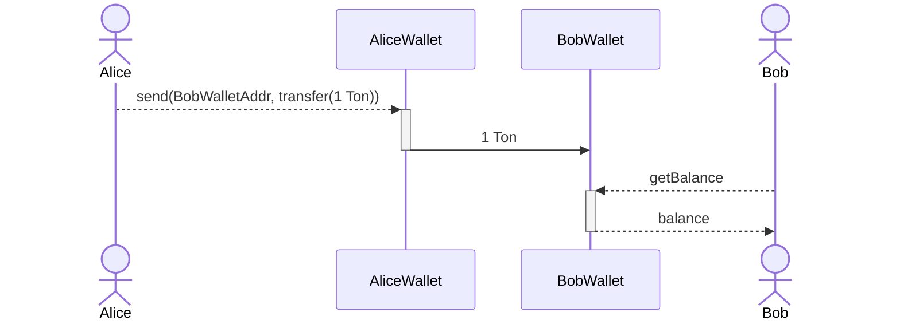
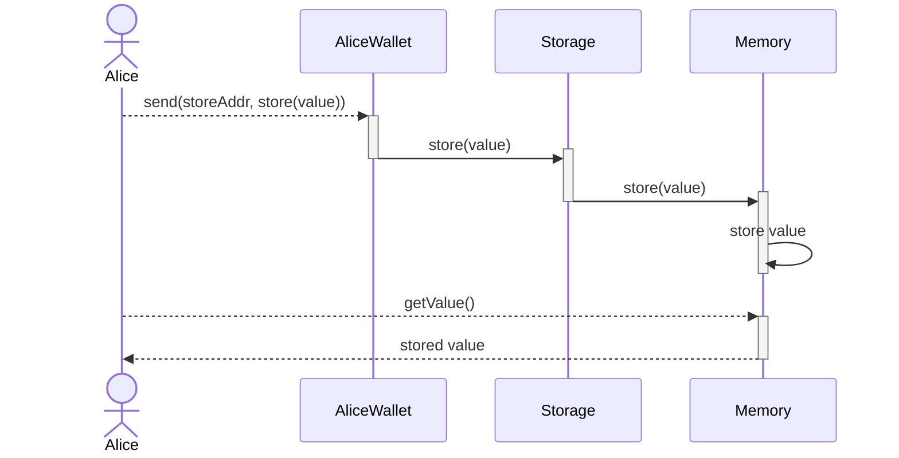
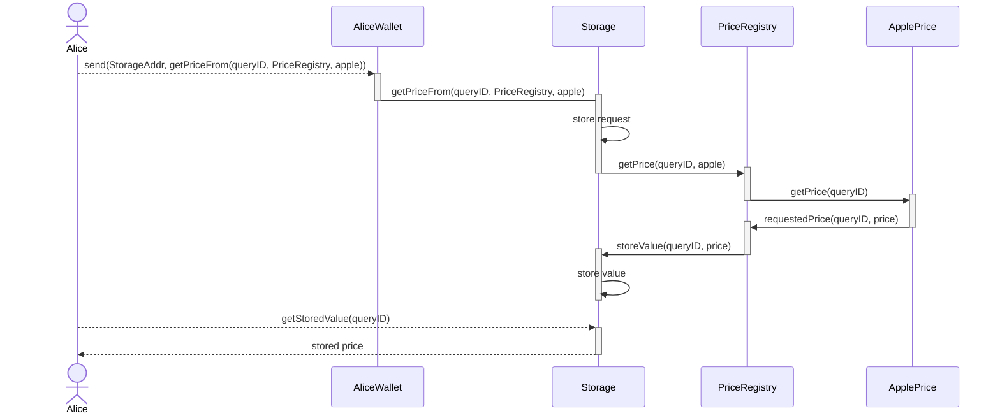
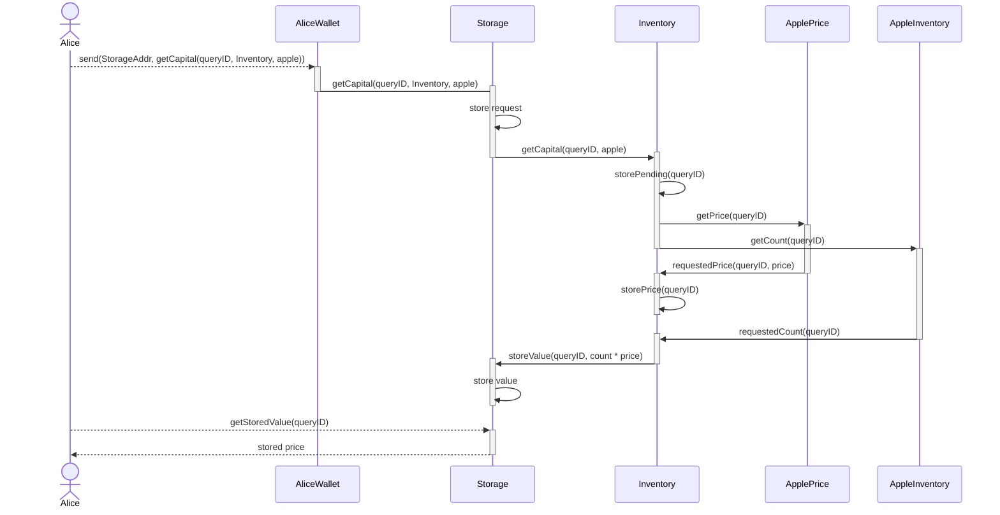
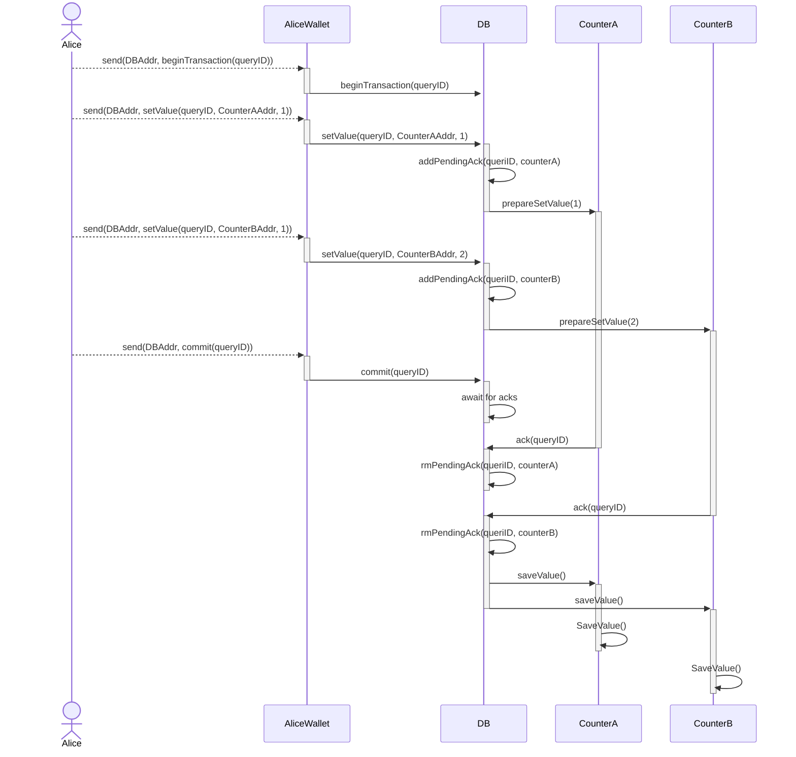

# Chainlink TON - Smart Contracts

## Project structure

- `contracts` - source code of all the smart contracts of the project and their dependencies.
- `wrappers` - wrapper classes (implementing `Contract` from ton-core) for the contracts, including any [de]serialization primitives and compilation functions.
- `tests` - tests for the contracts.
- `scripts` - scripts used by the project, mainly the deployment scripts.

## Documentation

- [Getting Started](../docs/getting-started.md)
- [Build](../docs/contracts/build.md)

## Experiments

Directory structure:

Contracts: ´/contracts/contracts/examples/<experiment_name>´
Wrappers: ´/contracts/wrappers/examples/<experiment_name>´
Tests: ´/contracts/tests/<experiment_name>_test.go´

### Diagram Convention

In the following diagrams, I am using dashed-line arrows --> to denote external messages, solid-line arrows for internal messages, actor for rpc clients and blocks for smart contracts.



### [x] Deposit

Simple deposit from one wallet to another



### [x] Test possible replay attack

An article described a possible attack vector consisting on replaying failed transactions. It suggested that the seqno of a wallet was not incremented when processing a transfer with an amount higher than the balance. This was proven to be false.

### [x] Two msg chain



### [x] Request-reply



### [x] Request-reply with two dependencies



This experiment has events all over the play to make it easier to track the flow.

### [ ] Two-phase Commit



### [ ] Saga pattern <https://medium.com/cloud-native-daily/microservices-patterns-part-04-saga-pattern-a7f85d8d4aa3>

## Discoveries

### Leading 0 bit on init data

Tact allows you two ways to declare the init process of a contract: [contract parameters](https://docs.tact-lang.org/book/contracts/#parameters) and [Constructor function init()](https://docs.tact-lang.org/book/contracts/#init-function). When encoding the init data for the latter, you must add a bit of value 0 before storing the rest of the arguments. I am not sure why, but I found out about this via the TS bindings generated.

When

### How to emmit event in Tact

```tact
let fizz: StringBuilder = beginComment();
fizz.append("GetPrice: ");
fizz.append("query_id: ");
fizz.append(msg.query_id.toString());
fizz.append(", key: ");
fizz.append(msg.key.toString());
emit(fizz.toCell());
```

This are stored in the `Events` field of `MessageReceived`.
