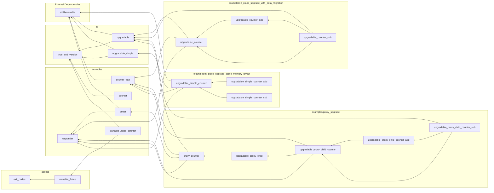

# Tact Dependencies Diagram

```mermaid
---
config:
  flowchart:
    rankSpacing: 100
---
flowchart RL
    subgraph access[access]
        access__exit_codes_tact[exit_codes]
        access__ownable_2step_tact[ownable_2step]
    end
    subgraph examples[examples]
        examples__counter_tact[counter]
        examples__counter_trait_tact[counter_trait]
        examples__responder_tact[responder]
        examples__getter_tact[getter]
        examples__ownable_2step_counter_tact[ownable_2step_counter]
    end
    subgraph examples_in_place_upgrade_with_data_migration[examples/in_place_upgrade_with_data_migration]
        examples__in_place_upgrade_with_data_migration__upgradable_counter_add_tact[upgradable_counter_add]
        examples__in_place_upgrade_with_data_migration__upgradable_counter_tact[upgradable_counter]
        examples__in_place_upgrade_with_data_migration__upgradable_counter_sub_tact[upgradable_counter_sub]
    end
    subgraph examples_proxy_upgrade[examples/proxy_upgrade]
        examples__proxy_upgrade__upgradable_proxy_child_tact[upgradable_proxy_child]
        examples__proxy_upgrade__upgradable_proxy_child_counter_tact[upgradable_proxy_child_counter]
        examples__proxy_upgrade__upgradable_proxy_child_counter_add_tact[upgradable_proxy_child_counter_add]
        examples__proxy_upgrade__upgradable_proxy_child_counter_sub_tact[upgradable_proxy_child_counter_sub]
        examples__proxy_upgrade__proxy_counter_tact[proxy_counter]
    end
    subgraph examples_in_place_upgrade_same_memory_layout[examples/in_place_upgrade_same_memory_layout]
        examples__in_place_upgrade_same_memory_layout__upgradable_simple_counter_add_tact[upgradable_simple_counter_add]
        examples__in_place_upgrade_same_memory_layout__upgradable_simple_counter_tact[upgradable_simple_counter]
        examples__in_place_upgrade_same_memory_layout__upgradable_simple_counter_sub_tact[upgradable_simple_counter_sub]
    end
    subgraph lib[lib]
        lib__upgradable_tact[upgradable]
        lib__upgradable_simple_tact[upgradable_simple]
        lib__type_and_version_tact[type_and_version]
    end
    subgraph external[External Dependencies]
        ext_stdlib__ownable[stdlib/ownable]
    end
    access__ownable_2step_tact --> access__exit_codes_tact
    examples__counter_tact --> lib__type_and_version_tact
    examples__counter_trait_tact --> ext_stdlib__ownable
    examples__getter_tact --> ext_stdlib__ownable
    examples__getter_tact --> examples__responder_tact
    examples__ownable_2step_counter_tact --> access__ownable_2step_tact
    examples__ownable_2step_counter_tact --> lib__type_and_version_tact
    examples__in_place_upgrade_with_data_migration__upgradable_counter_add_tact --> examples__in_place_upgrade_with_data_migration__upgradable_counter_tact
    examples__in_place_upgrade_with_data_migration__upgradable_counter_tact --> lib__upgradable_tact
    examples__in_place_upgrade_with_data_migration__upgradable_counter_tact --> examples__responder_tact
    examples__in_place_upgrade_with_data_migration__upgradable_counter_tact --> examples__counter_trait_tact
    examples__in_place_upgrade_with_data_migration__upgradable_counter_sub_tact --> examples__in_place_upgrade_with_data_migration__upgradable_counter_tact
    examples__in_place_upgrade_with_data_migration__upgradable_counter_sub_tact --> lib__upgradable_tact
    examples__in_place_upgrade_with_data_migration__upgradable_counter_sub_tact --> examples__in_place_upgrade_with_data_migration__upgradable_counter_add_tact
    examples__proxy_upgrade__upgradable_proxy_child_tact --> examples__proxy_upgrade__proxy_counter_tact
    examples__proxy_upgrade__upgradable_proxy_child_counter_tact --> examples__proxy_upgrade__upgradable_proxy_child_tact
    examples__proxy_upgrade__upgradable_proxy_child_counter_tact --> examples__responder_tact
    examples__proxy_upgrade__upgradable_proxy_child_counter_tact --> examples__counter_trait_tact
    examples__proxy_upgrade__upgradable_proxy_child_counter_add_tact --> examples__proxy_upgrade__upgradable_proxy_child_counter_tact
    examples__proxy_upgrade__upgradable_proxy_child_counter_sub_tact --> examples__proxy_upgrade__upgradable_proxy_child_counter_tact
    examples__proxy_upgrade__upgradable_proxy_child_counter_sub_tact --> lib__upgradable_tact
    examples__proxy_upgrade__upgradable_proxy_child_counter_sub_tact --> examples__proxy_upgrade__upgradable_proxy_child_counter_add_tact
    examples__proxy_upgrade__proxy_counter_tact --> examples__getter_tact
    examples__proxy_upgrade__proxy_counter_tact --> lib__upgradable_tact
    examples__proxy_upgrade__proxy_counter_tact --> examples__responder_tact
    examples__proxy_upgrade__proxy_counter_tact --> examples__counter_trait_tact
    examples__in_place_upgrade_same_memory_layout__upgradable_simple_counter_add_tact --> examples__in_place_upgrade_same_memory_layout__upgradable_simple_counter_tact
    examples__in_place_upgrade_same_memory_layout__upgradable_simple_counter_tact --> ext_stdlib__ownable
    examples__in_place_upgrade_same_memory_layout__upgradable_simple_counter_tact --> lib__upgradable_simple_tact
    examples__in_place_upgrade_same_memory_layout__upgradable_simple_counter_tact --> examples__responder_tact
    examples__in_place_upgrade_same_memory_layout__upgradable_simple_counter_tact --> examples__counter_trait_tact
    examples__in_place_upgrade_same_memory_layout__upgradable_simple_counter_sub_tact --> examples__in_place_upgrade_same_memory_layout__upgradable_simple_counter_tact
    lib__upgradable_tact --> ext_stdlib__ownable
    lib__upgradable_tact --> lib__type_and_version_tact
    lib__upgradable_simple_tact --> ext_stdlib__ownable
    lib__upgradable_simple_tact --> lib__type_and_version_tact
```
