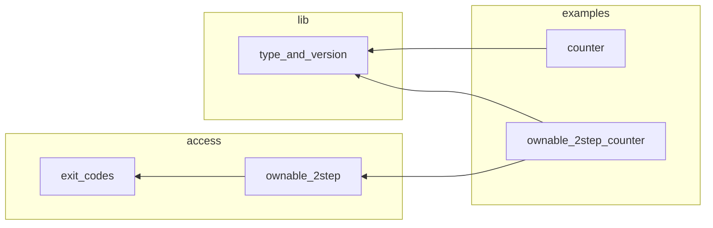

# Tact Dependencies Diagram

```mermaid
---
config:
  flowchart:
    rankSpacing: 100
---
flowchart RL
    subgraph access[access]
        access__exit_codes_tact[exit_codes]
        access__ownable_2step_tact[ownable_2step]
    end
    subgraph examples[examples]
        examples__counter_tact[counter]
        examples__ownable_2step_counter_tact[ownable_2step_counter]
    end
    subgraph lib[lib]
        lib__type_and_version_tact[type_and_version]
    end
    access__ownable_2step_tact --> access__exit_codes_tact
    examples__counter_tact --> lib__type_and_version_tact
    examples__ownable_2step_counter_tact --> access__ownable_2step_tact
    examples__ownable_2step_counter_tact --> lib__type_and_version_tact
```
