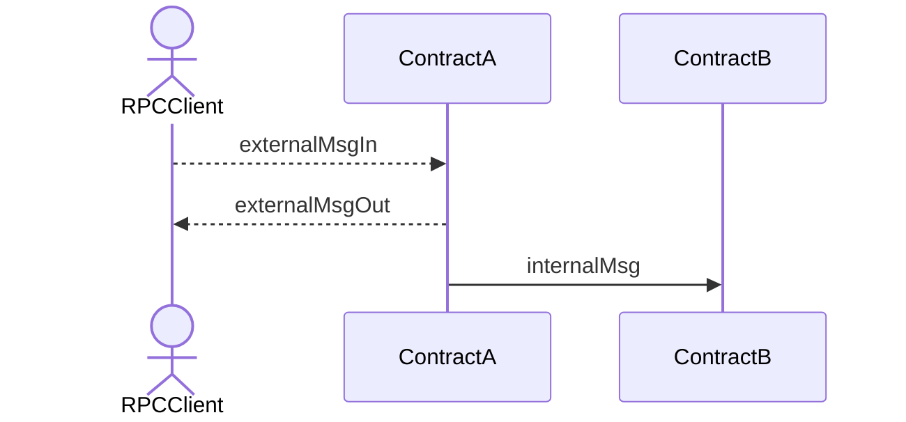
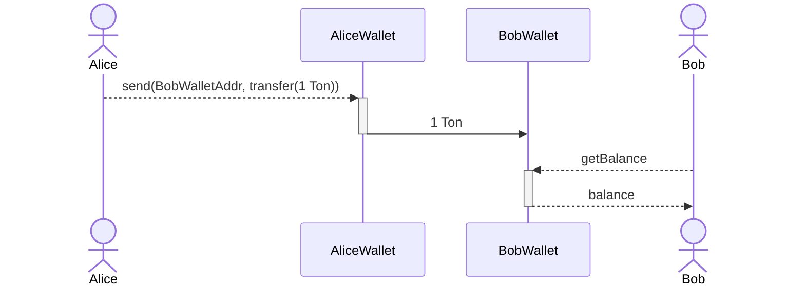
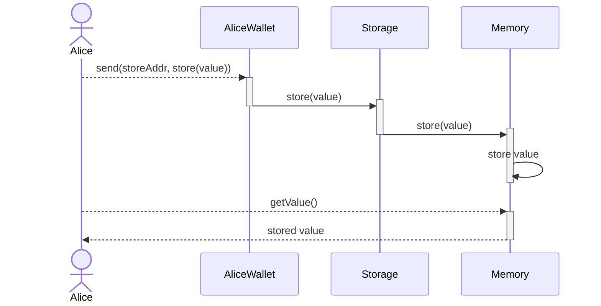
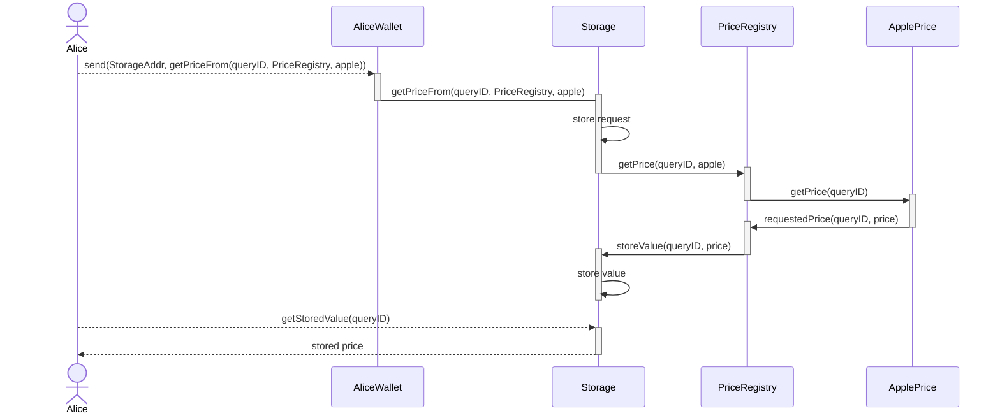
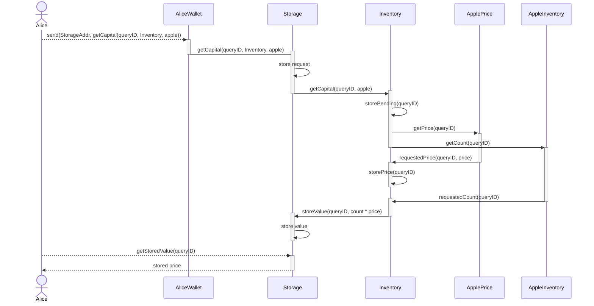
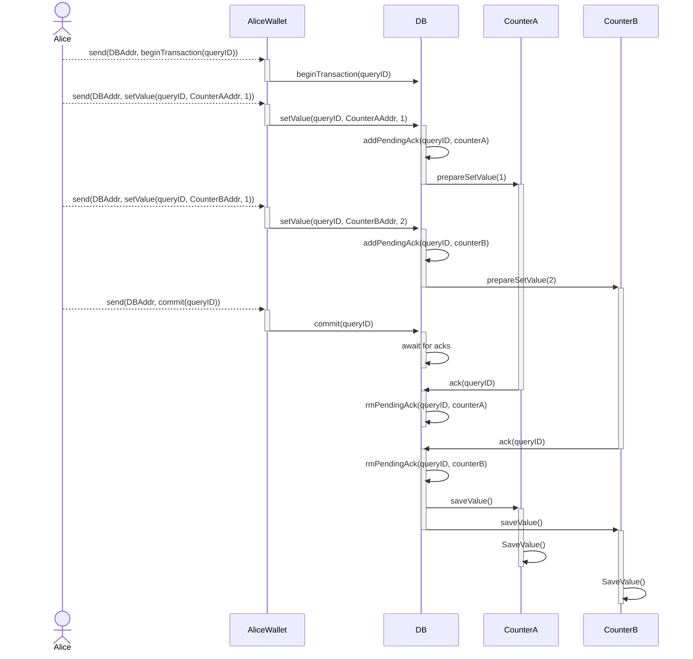

# Async Communication Examples

This document describes some examples developed to illustrate async communication

## Directory structure

- Contracts: `/contracts/contracts/examples/async-communication/<experiment_name>`
- Wrappers: `/contracts/wrappers/examples/async-communication/<experiment_name>`
- Tests: `/contracts/tests/async-communication/<experiment_name>_test.go`

## Running tests

To compile contracts, on repo root dir run:

```bash
yarn dev:build
```

Then you can run tests from contracts/tests.

To run a specific test, you might run `go test -v -run ^TestExampleName$ github.com/smartcontractkit/chainlink-ton/contracts/tests/`.

## Diagram Convention

Diagrams where made following [Mermaid](https://mermaid-js.github.io/mermaid/#/) syntax. If you are using VSCode, I suggest installing [Markdown Preview Mermaid Support](https://marketplace.visualstudio.com/items/?itemName=bierner.markdown-mermaid) extension.

In the following diagrams, I am using dashed-line arrows --> to denote external messages, solid-line arrows for internal messages, actor for rpc clients and blocks for smart contracts.



## Deposit

Simple deposit from one wallet to another



## Test possible replay attack

An article described a possible attack vector consisting on replaying failed transactions. It suggested that the seqno of a wallet was not incremented when processing a transfer with an amount higher than the balance. This was proven to be false.

## Two msg chain



## Request-reply



## Request-reply with two dependencies



This experiment has events all over the play to make it easier to track the flow.

## Two-phase Commit



It is missing a rollback, but that is pretty trivial.
