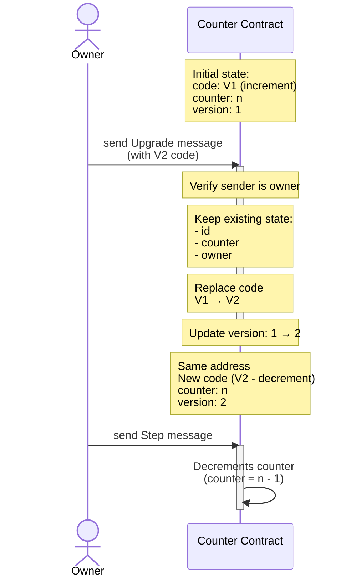
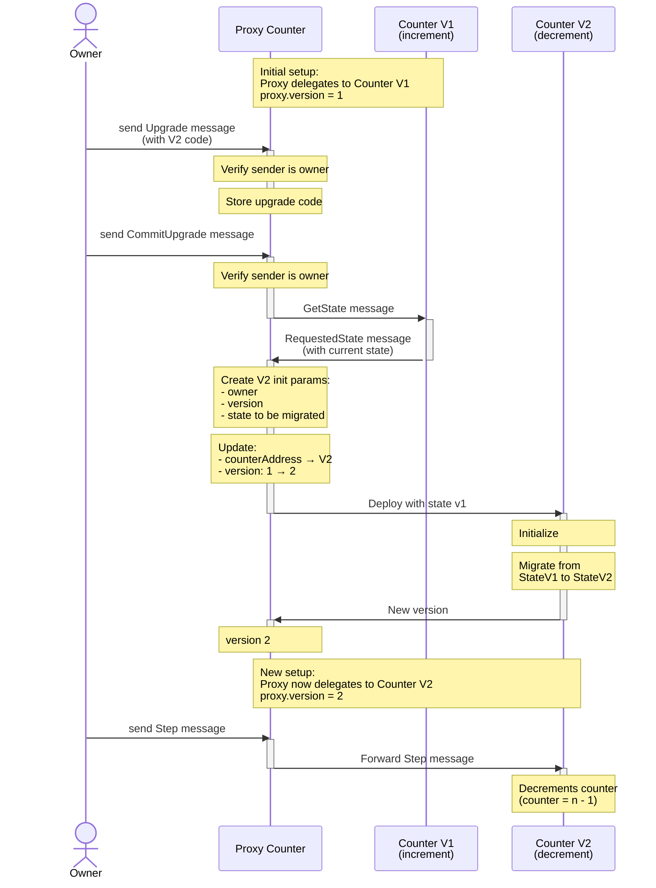
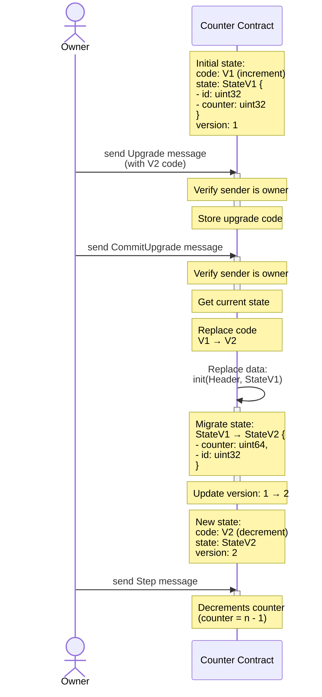

# Upgradability

## Upgradable(Simple) Counter

This counter can be upgraded in-place, but the data layout must always stay the same.

## Proxy Counter

This implements the proxy upgrade pattern usually used in EVM contracts. It supports migrating the data from one layout to a different one.

## Upgradadable Counter

This supports in-place upgrades with state migration. When the contract is initialized, it is provided de previous state, and it can migrate it to the new layout.

