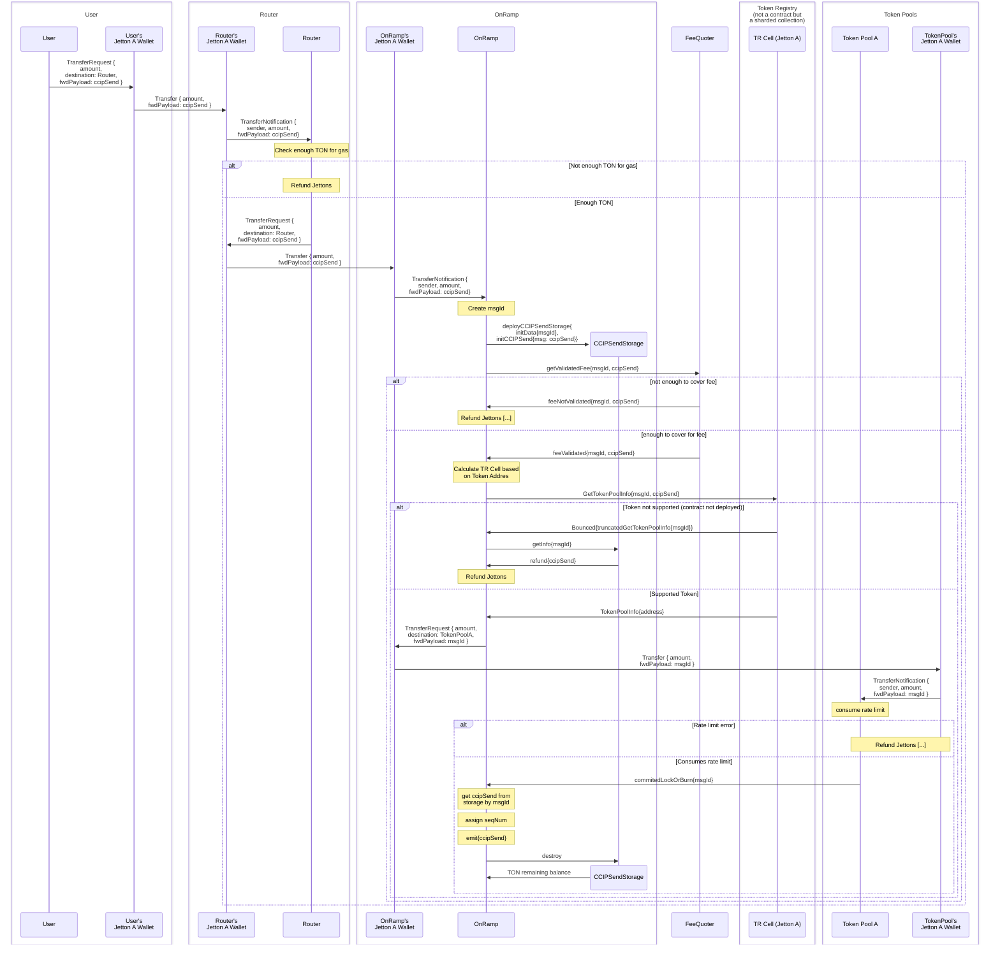

# CCIP Flow

## Token Transfer

### Token Transfer OnRamp Flow

```mermaid
---
config:
  sequence:
    
---
sequenceDiagram
    box User 
    participant U as User
    participant UJW as User's <br>Jetton A Wallet
    end

    box Router
    participant RJW as Router's <br>Jetton A Wallet
    participant R as Router
    end

    U ->> UJW: TransferRequest {<br>amount,<br>destination: Router,<br>fwdPayload: ccipSend }
    
    UJW ->> RJW: Transfer { amount,<br>fwdPayload: ccipSend }
    RJW ->> R: TransferNotification {<br>sender, amount,<br>fwdPayload: ccipSend}
    Note over R: Check enough TON for gas 
    alt Not enough TON for gas
    Note over R: Refund Jettons
    else Enough TON

    R ->> RJW: TransferRequest {<br>amount,<br>destination: Router,<br>fwdPayload: ccipSend }
    
    RJW ->> ORJW: Transfer { amount,<br>fwdPayload: ccipSend }
    ORJW ->> OR: TransferNotification {<br>sender, amount,<br>fwdPayload: ccipSend}

    Note over OR: Create msgId
    create participant CS as CCIPSendStorage
    OR ->> CS: deployCCIPSendStorage{<br>initData{msgId},<br>initCCIPSend{msg: ccipSend}}

    box OnRamp
    participant ORJW as OnRamp's <br>Jetton A Wallet
    participant OR as OnRamp
    participant CS as CCIPSendStorage
    end

    participant FQ as FeeQuoter

    box Token Registry<br>(not a contract but<br>a sharded collection)
    participant TRC as TR Cell (Jetton A)
    end

    box Token Pools
    participant TP as Token Pool A
    participant TPJW as TokenPool's <br>Jetton A Wallet
    end

    OR ->> FQ: getValidatedFee{msgId, ccipSend}


    alt not enough to cover fee
    FQ ->> OR: feeNotValidated{msgId, ccipSend}
    Note over OR: Refund Jettons [...]

    else enough to cover for fee
    FQ ->> OR: feeValidated{msgId, ccipSend}
    Note over OR: Calculate TR Cell based<br>on Token Addres

    OR ->> TRC: GetTokenPoolInfo{msgId, ccipSend}

    alt Token not supported (contract not deployed)
    TRC ->> OR: Bounced{truncatedGetTokenPoolInfo{msgId}}
    OR ->> CS: getInfo{msgId}
    CS ->> OR: refund{ccipSend}
    Note over OR: Refund Jettons
    else Supported Token
    TRC ->> OR: TokenPoolInfo{address}

    OR ->> ORJW: TransferRequest { amount,<br>destination: TokenPoolA,<br>fwdPayload: msgId }
    
    ORJW ->> TPJW: Transfer { amount,<br>fwdPayload: msgId }
    TPJW ->> TP: TransferNotification {<br>sender, amount,<br>fwdPayload: msgId }
    Note over TP: consume rate limit
    alt Rate limit error
    Note over TP, TPJW: Refund Jettons [...]

    else Consumes rate limit
    TP ->> OR: commitedLockOrBurn{msgId}
    note over OR: get ccipSend from<br>storage by msgId
    note over OR: assign seqNum
    note over OR: emit{ccipSend}
    OR ->> CS: destroy
    destroy CS
    CS ->> OR: TON remaining balance
    end
    end
    end
    end
```