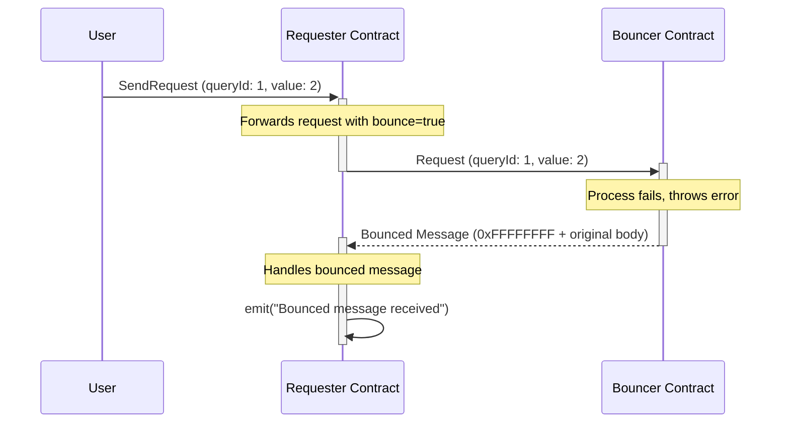
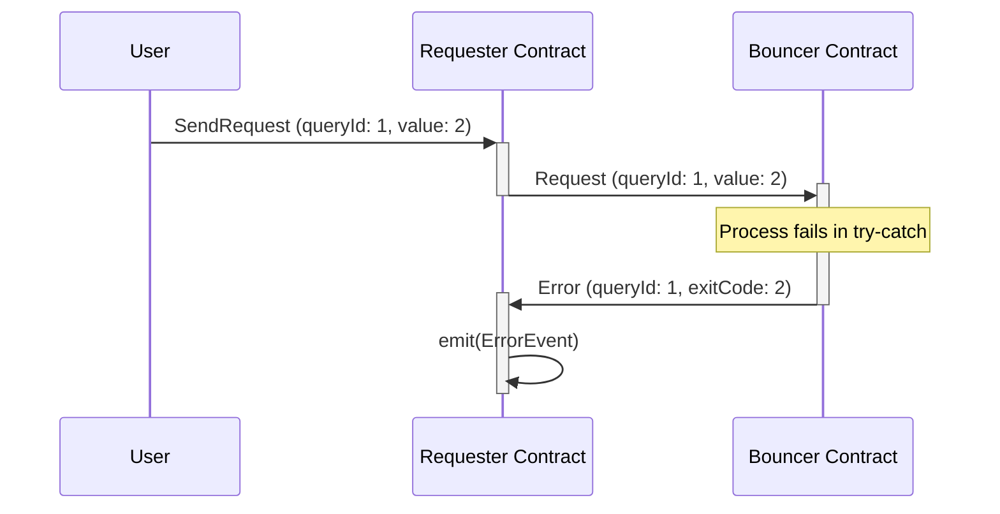

# Error Management in TON Contracts

TON provides two main approaches for managing errors across contracts. This document explores both methods with practical examples.

## Approach 1: Bounce Messages

The simplest error handling mechanism in TON is **bounce messages**. When a message processing fails and throws an error, and the incoming message was marked as bounceable, the destination contract automatically sends a **bounce message** back to the sender.

### How Bounce Messages Work



### Key Characteristics of Bounce Messages

- **Automatic**: Sent automatically when message processing fails
- **Body Format**: Contains the original message body prepended with bounce opcode `0xFFFFFFFF`
- **Size Limitations**: 
  - Maximum 256 bits of payload and no references
  - Only 224 bits of useful data available in bounced receivers
- **No Control**: You cannot customize the content of bounced messages

### Example: Standard Bounce Message Handling

In the `requester.tact` contract, bounce messages are handled using the `bounced` receiver:

```tact
contract Requester() {
    receive(msg: SendRequest) {
        // Send message with bounce enabled (default)
        message(MessageParameters {
            to: msg.address,
            value: 0,
            mode: SendRemainingValue | SendIgnoreErrors,
            body: Request {
                queryId: msg.queryId,
                value: msg.value,
            }.toCell(),
        });
    }

    bounced(msg: bounced<Request>) {
        emit("Bounced message received".asComment());
    }
}
```

## Approach 2: Handcrafted Error Messages

For more sophisticated error handling, you can implement custom error messaging using Tact's **try-catch** functionality. This approach gives you full control over error communication.

### How Handcrafted Error Messages Work



### Benefits of Handcrafted Error Messages

- **Custom Data**: Include specific error information (exit codes, context)
- **No Size Limits**: Not restricted to 224-bit payload limitation
- **Controlled Flow**: Explicit error handling and response
- **Rich Information**: Can include multiple fields and references

## Examples

Code examples can be found at:

BounceMessages:

- [Contracts](../../../../contracts/contracts/examples/bounced-messages)
- [Tests](../../../../contracts/tests/examples/bounced-messages/BouncedMessages.spec.ts)

Handcrafted Error logic:

- [Contracts](../../../../contracts/contracts/examples/handcrafted-bounced-messages)
- [Tests](../../../../contracts/tests/examples/handcrafted-bounced-messages/HandcraftedBouncedMessages.spec.ts)

## Sources

<https://docs.ton.org/v3/documentation/smart-contracts/transaction-fees/forward-fees#standard-message-handling>
<https://docs.ton.org/v3/documentation/smart-contracts/message-management/non-bounceable-messages> 
<https://docs.tact-lang.org/book/bounced/>
