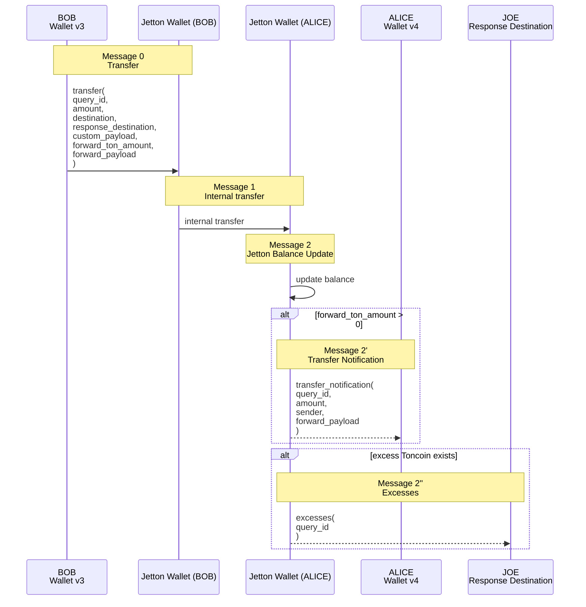

# Jettons - TON Tokens

https://docs.ton.org/v3/guidelines/dapps/asset-processing/jetton/#jetton-master-smart-contract

https://docs.ton.org/img/docs/asset-processing/jetton_transfer.png?raw=true 

