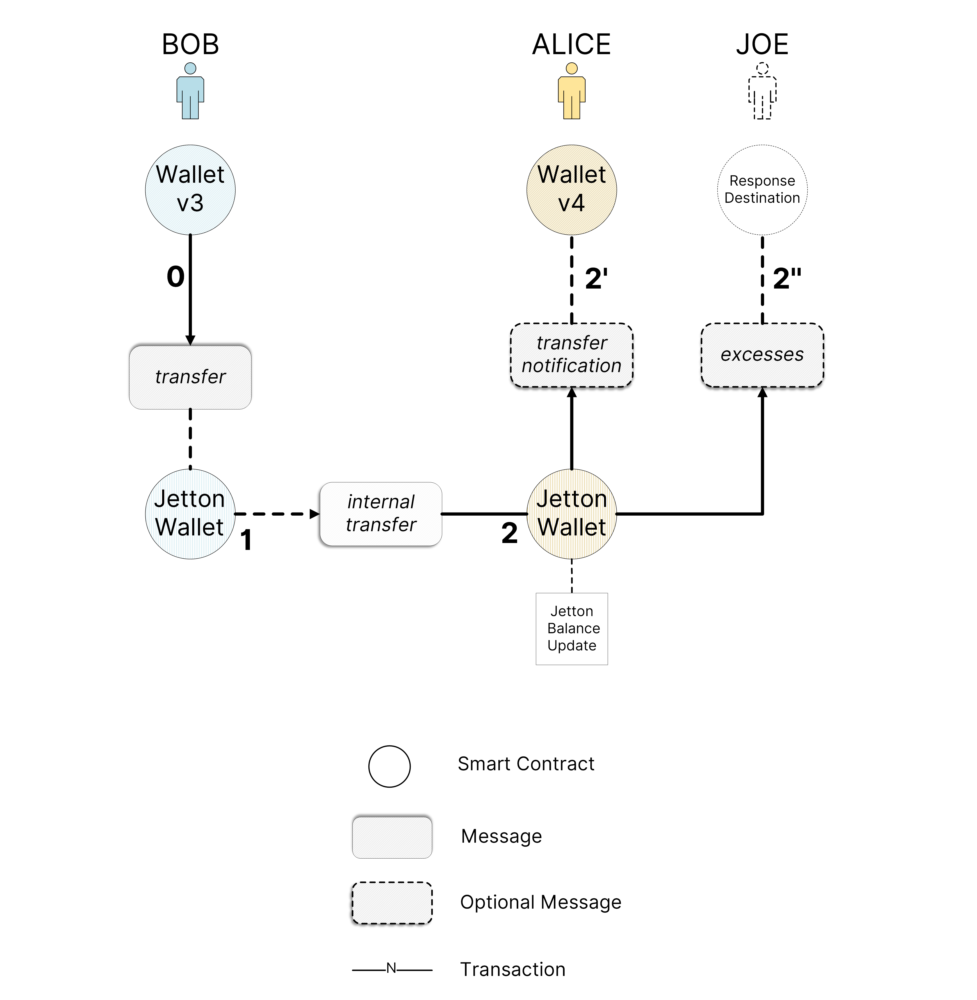
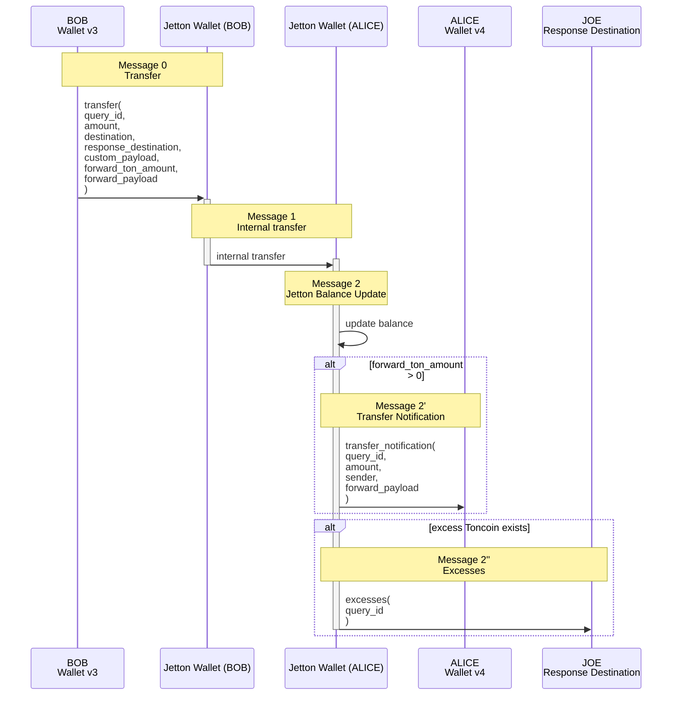

# Jettons - TON Tokens

Jettons is the TON standard for Fungible Tokens.

## Basic workflow





## Usage

The [func implementation of Jettons](https://github.com/ton-blockchain/jetton-contract/tree/3d24b419f2ce49c09abf6b8703998187fe358ec9/contracts) is made available throguh nix.
The minter and wallet contracts can be built by running

```bash
nix build .#contracts-jetton-func
```

appending `--print-out-paths` at the end displays the directory where they can be located.

```bash
$ nix build .#contracts-jetton-func --print-out-paths
/nix/store/s3rsxlqskan6ripf2sii9njrzv1mhbxz-contracts-jetton-func-1.2.0
```

Furthermore, the `#contracts` nix shell compiles and exposes the build directory through the environment variable `PATH_CONTRACTS_JETTON`.

```bash
$ nix develop .#contracts -c ls -lca $PATH_CONTRACTS_JETTON
Jetton contracts located here: /nix/store/s3rsxlqskan6ripf2sii9njrzv1mhbxz-contracts-jetton-func-1.2.0/lib/node_modules/jetton/build/
total 16
dr-xr-xr-x  6 root wheel  192 Jul  8 14:47 .
dr-xr-xr-x 15 root wheel  480 Jul  8 14:47 ..
-r--r--r--  1 root wheel 2386 Jul  8 14:47 JettonMinter.compiled.json
-r--r--r--  1 root wheel 1834 Jul  8 14:47 JettonWallet.compiled.json
```

## Docs

<https://github.com/ton-blockchain/TEPs/blob/master/text/0074-jettons-standard.md>
<https://docs.ton.org/v3/guidelines/dapps/asset-processing/jetton/#jetton-master-smart-contract>
<https://docs.ton.org/img/docs/asset-processing/jetton_transfer.png?raw=true>
