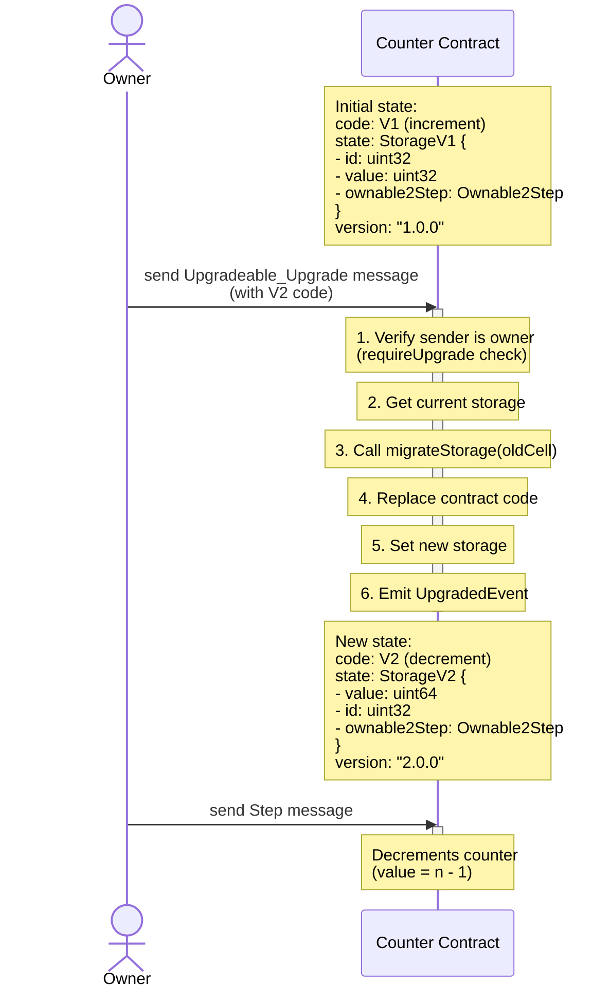

# Chainlink TON - Contract upgradability - Upgradeable

This module implements the ability for a contract to upgrade its code and migrate its storage layout from one version to another.

[An upgradeable counter example can be found here.](../../../../contracts/contracts/examples/upgrades/)

## Interface

### Provides

The `Upgradeable` struct provides message handling for upgrade operations:

```tolk
struct Upgradeable<T> {
    /// Abstract methods that must be implemented by the contract.
    migrateStorage: (cell) -> cell;
    version: () -> slice;
    /// Provided methods that can be overridden by the contract.
    requireUpgrade: Upgradeable_requireUpgrade<T>; // This method requires the sender to be the contract owner by default.
}
```

Handles `Upgradeable_Upgrade` message of type:

```tolk
/// Message for upgrading a contract.
struct (0x0aa811ed) Upgradeable_Upgrade {
    queryId: uint64;
    code: cell;
}
```

Emits an `UpgradedEvent` upon successful upgrade:

```tolk
struct UpgradedEvent {
    /// The new code of the contract.
    code: cell;
    /// The SHA256 hash of the new code.
    sha: uint256;
    /// The version of the contract after the upgrade.
    version: UnsafeBodyNoRef<slice>;
}
```

### Requirements

Required method implementations in your contract:

```tolk
/// Storage migration function with method_id(1000)
@method_id(1000)
fun migrateStorage(c: cell): cell { 
    // Implement storage migration logic here
}

/// Version function with method_id(1001)  
@method_id(1001)
fun version(): slice { 
    return "1.0.0"; // Your contract version
}
```

Required ownership validation (using Ownable2Step):

```tolk
struct requireUpgradeAutoArgs {
    ownable2Step: Ownable2Step;
    sender: address;
}

fun requireUpgrade(autoargs: requireUpgradeAutoArgs) {
    autoargs.ownable2Step.requireOwner(autoargs.sender)
}
```

## Storage Migration

The upgrade mechanism allows for storage layout changes between contract versions. Each contract version must implement a `migrateStorage` function that converts the previous version's storage format to the current version's format.

### Example Implementation

**Version 1 Storage:**

```tolk
struct StorageV1 {
    id: uint32;
    value: uint32;
    ownable2Step: Ownable2Step;
}
```

**Version 2 Storage:**

```tolk
struct StorageV2 {
    value: uint64;  // Changed from uint32 to uint64
    id: uint32;
    ownable2Step: Ownable2Step;
}
```

**Migration Implementation (V2):**

```tolk
@method_id(1000)
fun migrateStorage(c: cell): cell {
    // Parse the old storage format
    var oldStorage = StorageV1.fromCell(c);
    
    // Create new storage with migrated data
    var newStorage = StorageV2{
        value: oldStorage.value as uint64,  // Convert uint32 to uint64
        id: oldStorage.id,
        ownable2Step: oldStorage.ownable2Step,  // Keep ownership unchanged
    };
    
    return newStorage.toCell();
}
```

## Contract Integration

To integrate the Upgradeable module into your contract:

1. **Include the module in your message handler:**

```tolk
fun onInternalMessage(myBalance: int, msgValue: int, msgFull: cell, msgBody: slice) {
    // Handle ownership messages first
    var storage = loadData();
    var handled = storage.ownable2Step.onInternalMessage(myBalance, msgValue, msgFull, msgBody);
    
    if (handled) {
        saveData(storage);
        return;
    }
    
    // Handle upgrade messages
    val upgradeable = Upgradeable<requireUpgradeAutoArgs>{
        version: version,
        migrateStorage: migrateStorage,
        requireUpgrade: Upgradeable_requireUpgrade<requireUpgradeAutoArgs> {
            call: requireUpgrade,
            autoArgs: requireUpgradeAutoArgs {
                ownable2Step: storage.ownable2Step,
                sender: sender,
            },
        },
    };
    
    if (upgradeable.onInternalMessage(myBalance, msgValue, msgFull, msgBody)) {
        return;
    }
    
    // Handle your contract's custom messages
    // ...
}
```

**Implement required getters:**

```tolk
get typeAndVersion(): (slice, slice) {
    val storage = loadData();
    val this = UpgradeableCounter{
        versionStr: "1.0.0",
        version: version,
        migrateStorage: migrateStorage,
        ownable2Step: storage.ownable2Step,
    };
    return this.typeAndVersion();
}
```

## Upgrade Flow


