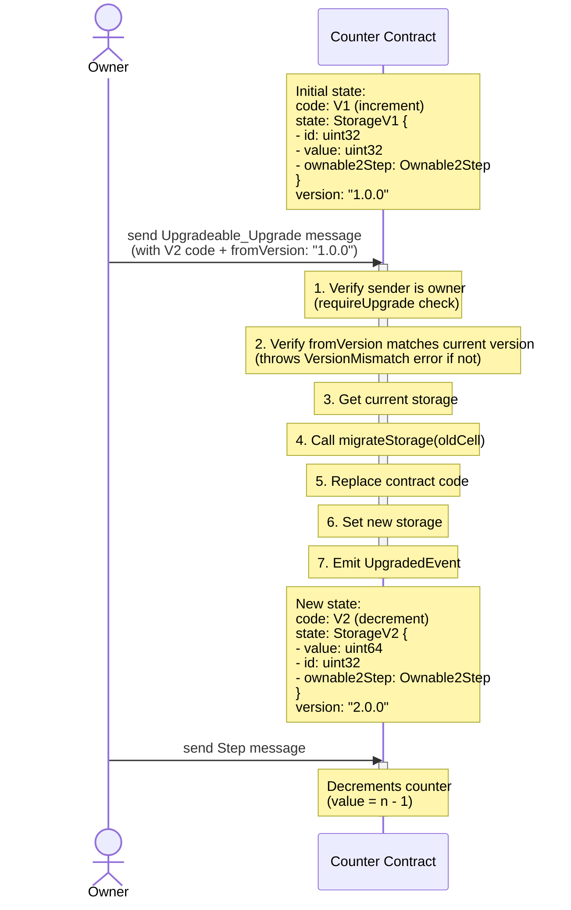

# Chainlink TON - Contract upgradability - Upgradeable

This module implements the ability for a contract to upgrade its code and migrate its storage layout from one version to another.

[An upgradeable counter example can be found here.](../../../../contracts/contracts/examples/upgrades/)

## Interface

### Provides

The `Upgradeable` struct provides message handling for upgrade operations:

```tolk
struct Upgradeable<T> {
    /// Abstract methods that must be implemented by the contract.
    migrateStorage: (cell) -> cell;
    version: () -> slice;
    /// Provided methods that can be overridden by the contract.
    requireUpgrade: Upgradeable_requireUpgrade<T>; // This method requires the sender to be the contract owner by default.
}
```

Handles `Upgradeable_Upgrade` message of type:

```tolk
/// Message for upgrading a contract.
struct (0x0aa811ed) Upgradeable_Upgrade {
    queryId: uint64;
    code: cell;
    fromVersion: RemainingBitsAndRefs;
}
```

The `fromVersion` parameter ensures that upgrades are performed from the expected version, preventing accidental upgrades from intermediate or incorrect versions.

Emits an `UpgradedEvent` upon successful upgrade:

```tolk
struct UpgradedEvent {
    /// The new code of the contract.
    code: cell;
    /// The SHA256 hash of the new code.
    hash: uint256;
    /// The version of the contract after the upgrade.
    version: UnsafeBodyNoRef<slice>;
}
```

### Error Codes

The module defines the following error codes:

```tolk
enum Upgradeable_Error {
    VersionMismatch = 43700; // Thrown when fromVersion doesn't match current version
}
```

### Requirements

Required method implementations in your contract:

```tolk
/// Storage migration function with method_id(1000)
@method_id(1000)
fun migrateStorage(c: cell): cell { 
    // Implement storage migration logic here
}

/// Version function with method_id(1001)  
@method_id(1001)
fun version(): slice { 
    return "1.0.0"; // Your contract version
}
```

Required ownership validation (using Ownable2Step):

```tolk
struct requireUpgradeAutoArgs {
    ownable2Step: Ownable2Step;
    sender: address;
}

fun requireUpgrade(autoargs: requireUpgradeAutoArgs) {
    autoargs.ownable2Step.requireOwner(autoargs.sender)
}
```

## Storage Migration

The upgrade mechanism allows for storage layout changes between contract versions. Each contract version must implement a `migrateStorage` function that converts the previous version's storage format to the current version's format.

### Example Implementation

**Version 1 Storage:**

```tolk
struct StorageV1 {
    id: uint32;
    value: uint32;
    ownable2Step: Ownable2Step;
}
```

**Version 2 Storage:**

```tolk
struct StorageV2 {
    value: uint64;  // Changed from uint32 to uint64
    id: uint32;
    ownable2Step: Ownable2Step;
}
```

**Migration Implementation (V2):**

```tolk
@method_id(1000)
fun migrateStorage(c: cell): cell {
    // Parse the old storage format
    var oldStorage = StorageV1.fromCell(c);
    
    // Create new storage with migrated data
    var newStorage = StorageV2{
        value: oldStorage.value as uint64,  // Convert uint32 to uint64
        id: oldStorage.id,
        ownable2Step: oldStorage.ownable2Step,  // Keep ownership unchanged
    };
    
    return newStorage.toCell();
}
```

## Contract Integration

To integrate the Upgradeable module into your contract:

1. **Include the module in your message handler:**

```tolk
fun onInternalMessage(myBalance: int, msgValue: int, msgFull: cell, msgBody: slice) {
    // Handle ownership messages first
    var storage = loadData();
    var handled = storage.ownable2Step.onInternalMessage(myBalance, msgValue, msgFull, msgBody);
    
    if (handled) {
        saveData(storage);
        return;
    }
    
    // Handle upgrade messages
    val upgradeable = Upgradeable<requireUpgradeAutoArgs>{
        version: version,
        migrateStorage: migrateStorage,
        requireUpgrade: Upgradeable_requireUpgrade<requireUpgradeAutoArgs> {
            call: requireUpgrade,
            autoArgs: requireUpgradeAutoArgs {
                ownable2Step: storage.ownable2Step,
                sender: sender,
            },
        },
    };
    
    if (upgradeable.onInternalMessage(myBalance, msgValue, msgFull, msgBody)) {
        return;
    }
    
    // Handle your contract's custom messages
    // ...
}
```

**Implement required getters:**

```tolk
get fun typeAndVersion(): (slice, slice) {
    val storage = loadData();
    val this = UpgradeableCounter{
        versionStr: "1.0.0",
        version: version,
        migrateStorage: migrateStorage,
        ownable2Step: storage.ownable2Step,
    };
    return this.typeAndVersion();
}
```

## Upgrade Flow

The upgrade process includes version verification to ensure upgrades are performed from the expected version:


```mermaid
---
config:
  "sequence":
    "noteAlign": "left"
---
sequenceDiagram
    actor Owner
    participant Counter as Counter Contract
    
    Note over Counter: Initial state:<br/>code: V1 (increment)<br/>state: StorageV1 {<br/>- id: uint32<br/>- value: uint32<br/>- ownable2Step: Ownable2Step<br/>}<br/>version: "1.0.0"

    Owner->>Counter: send Upgradeable_Upgrade message<br/>(with V2 code + fromVersion: "1.0.0")
    activate Counter
    Note over Counter: 1. Verify sender is owner<br/>(requireUpgrade check)
    Note over Counter: 2. Verify fromVersion matches current version<br/>(throws VersionMismatch error if not)
    Note over Counter: 3. Get current storage
    Note over Counter: 4. Call migrateStorage(oldCell)
    Note over Counter: 5. Replace contract code
    Note over Counter: 6. Set new storage
    Note over Counter: 7. Emit UpgradedEvent
    deactivate Counter

    Note over Counter: New state:<br/>code: V2 (decrement)<br/>state: StorageV2 {<br/>- value: uint64<br/>- id: uint32<br/>- ownable2Step: Ownable2Step<br/>}<br/>version: "2.0.0"

    Owner->>Counter: send Step message
    activate Counter
    Note over Counter: Decrements counter<br/>(value = n - 1)
    deactivate Counter
```

### Version Mismatch Protection

The upgrade mechanism includes built-in protection against incorrect version upgrades:

```typescript
// ✅ Correct: Upgrading from the current version
await contract.sendUpgrade(owner.getSender(), toNano('0.05'), {
  queryId: 0n,
  fromVersion: '1.0.0',  // Matches current version
  code: v2Code,
})

// ❌ Incorrect: Will fail with exit code 43700 (VersionMismatch)
await contract.sendUpgrade(owner.getSender(), toNano('0.05'), {
  queryId: 0n,
  fromVersion: '2.0.0',  // Doesn't match current version "1.0.0"
  code: v2Code,
})
```

This prevents scenarios where:

- A contract is upgraded from an unexpected intermediate version
- Multiple upgrade transactions are sent simultaneously
- An old upgrade transaction is replayed after a newer upgrade has completed

## Testing Upgradeable Contracts

The framework provides two reusable test specifications for upgradeable contracts:

1. **`newUpgradeSpec`**: Tests the upgrade process from a previous version to a current version
2. **`newCurrentVersionSpec`**: Tests the current version's upgradeable interface without going through the upgrade process

This separation allows you to test the upgrade path separately from the current version's behavior, avoiding unnecessary setup when you only need to test the current version.

### Testing Upgrade Process

Use `newUpgradeSpec` to test that upgrades work correctly from a previous version to the current version:

```typescript
import { newUpgradeSpec } from '../../../wrappers/libraries/upgrades/UpgradeableSpec'
import { UpgradeableCounterV1 } from '../../../wrappers/examples/upgrades/UpgradeableCounterV1'
import { UpgradeableCounterV2 } from '../../../wrappers/examples/upgrades/UpgradeableCounterV2'

describe('UpgradeableCounter - Upgrade Tests', () => {
  const upgradeSpec = newUpgradeSpec(
    {
      contractType: UpgradeableCounterV1.type(),
      prevVersion: UpgradeableCounterV1.version(),
      currentVersion: UpgradeableCounterV2.version(),
      getPrevCode: () => UpgradeableCounterV1.code(),
      getCurrentCode: () => UpgradeableCounterV2.code(),
      CurrentVersionConstructor: UpgradeableCounterV2,
      upgradeValue: toNano('0.05'), // Optional: defaults to 0.05 TON
    },
    async (blockchain, owner) => {
      // Setup function: deploy your previous version contract
      const code = await UpgradeableCounterV1.code()
      const contract = blockchain.openContract(
        UpgradeableCounterV1.createFromConfig(
          {
            id: 0,
            value: 0,
            ownable: { owner: owner.address, pendingOwner: null },
          },
          code,
        ),
      )
      const deployer = await blockchain.treasury('deployer')
      await contract.sendDeploy(deployer.getSender(), toNano('0.05'))
      return contract
    },
  )

  upgradeSpec.run()
})
```

#### Upgrade Test Coverage

The upgrade test spec provides the following test cases:

1. **should deploy on correct version**: Verifies that the previous version contract deploys with the correct version, type, code, and code hash
2. **should upgrade from previous to current version**: Tests the complete upgrade flow, including:
   - Version verification before and after upgrade
   - Code and code hash verification
   - Upgrade event emission with correct version, code, and code hash
3. **should fail when fromVersion does not match current version**: Verifies that upgrades fail with exit code 43700 when `fromVersion` doesn't match the current version

### Testing Current Version

Use `newCurrentVersionSpec` to test the current version's upgradeable interface directly:

```typescript
import { newCurrentVersionSpec } from '../../../wrappers/libraries/upgrades/UpgradeableSpec'
import { UpgradeableCounterV2 } from '../../../wrappers/examples/upgrades/UpgradeableCounterV2'

describe('UpgradeableCounter - Current Version Tests', () => {
  const currentVersionSpec = newCurrentVersionSpec(
    {
      contractType: UpgradeableCounterV2.type(),
      currentVersion: UpgradeableCounterV2.version(),
      getCurrentCode: () => UpgradeableCounterV2.code(),
      CurrentVersionConstructor: UpgradeableCounterV2,
      upgradeValue: toNano('0.05'), // Optional: defaults to 0.05 TON
    },
    async (blockchain, owner) => {
      // Setup function: deploy your current version contract directly
      const code = await UpgradeableCounterV2.code()
      const contract = blockchain.openContract(
        UpgradeableCounterV2.createFromConfig(
          {
            id: 0,
            value: 0,
            ownable: { owner: owner.address, pendingOwner: null },
          },
          code,
        ),
      )
      const deployer = await blockchain.treasury('deployer')
      await contract.sendDeploy(deployer.getSender(), toNano('0.05'))
      return contract
    },
  )

  currentVersionSpec.run()

  // Add your contract-specific tests
  it('should decrement counter', async () => {
    // Your custom test logic
  })
})
```

#### Current Version Test Coverage

The current version test spec provides the following test cases:

1. **should deploy on correct version**: Verifies that the contract deploys with the correct version, type, code, and code hash
2. **should fail when non-owner tries to upgrade**: Ensures that only the owner can perform upgrades

### Configuration Options

#### UpgradeTestConfig

For `newUpgradeSpec`, accepts the following parameters:

- `contractType`: The expected contract type name (e.g., from `YourContract.type()`)
- `prevVersion`: Version string for the previous version contract (e.g., from `YourContractV1.version()`)
- `currentVersion`: Version string for the current version contract (e.g., from `YourContractV2.version()`)
- `getPrevCode`: Function to get the code for the previous version contract
- `getCurrentCode`: Function to get the code for the current version contract
- `CurrentVersionConstructor`: Constructor class for the current version contract
- `upgradeValue` (optional): Amount of TON to use for upgrade transactions (defaults to 0.05 TON)

#### CurrentVersionTestConfig

For `newCurrentVersionSpec`, accepts the following parameters:

- `contractType`: The expected contract type name (e.g., from `YourContract.type()`)
- `currentVersion`: Version string for the current version contract (e.g., from `YourContractV2.version()`)
- `getCurrentCode`: Function to get the code for the current version contract
- `CurrentVersionConstructor`: Constructor class for the current version contract
- `upgradeValue` (optional): Amount of TON to use for upgrade transactions (defaults to 0.05 TON)

### Benefits

- **Separation of Concerns**: Test upgrade process separately from current version behavior
- **Efficiency**: Skip upgrade setup when testing current version features
- **Consistency**: All upgradeable contracts are tested the same way
- **Maintainability**: Bug fixes and improvements to upgrade testing are automatically applied to all contracts
- **Focus**: Allows you to focus on testing contract-specific functionality
- **Type Safety**: Properly typed with `SandboxContract<UpgradeableContract>` for full TypeScript support
