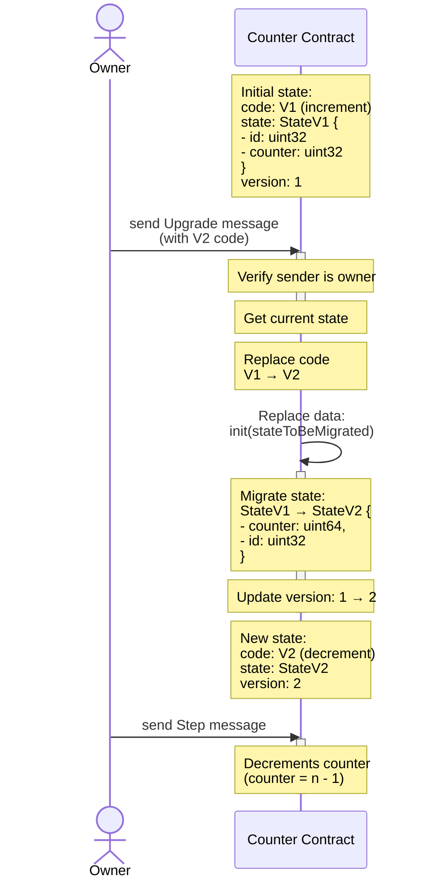

# Chainlink TON - Contract upgradability - Upgradable

This trait implements the ability for a contract to upgrade its code and migrate its storage layout from one version to another.

[An upgradable counter example can be found here.](../../../../contracts/contracts/examples/upgrades/)

## Interface

### Provides

Exposes receiver for `Upgrade` message of type:

```tact
/// Message for upgrading a contract.
message(10) Upgrade {
    code: Cell;
}
```

Provides the following getters:

```tact
/// A getter to check if the contract uses this trait.
get fun isUpgradable(): Bool

/// A getter returning the current version of the contract.
get fun type_and_version(): String
```

### Requirements

Required contract attributes:

```tact
/// Contract owner address that can perform upgrades.
owner: Address;
```

Required function implementations:

```tact
/// Version must be a semantic version string (e.g. "1.0.0").
abstract fun upgradableVersion(): String;

// Type must be a Reverse Domain Name Notation string that is unique to the contract and should not change between versions.
// Example: "com.chainlink.project.package.ContractName"
// Read more about Reverse DNS Notation at https://en.wikipedia.org/wiki/Reverse_domain_name_notation
abstract fun upgradableType(): String;
```

## Speciali initialization

Given the storage layout between two contract may be different, the trait implements the ability to migrate from one version to the next. The implementor must have an `init()` function that receives the previous layout as a Cell, and parses it with the layout of the previous version.

Example:

Version 1

```tact
contract UpgradableCounterV1 with UpgradableCounter {
    owner: Address;
    id: Int as uint32;
    value: Int as uint32;
}
```

Version 2

```tact
struct UpgradableCounterV1Layout {
    lazyDeploymentBit: Bool;
    owner: Address;
    id: Int as uint32;
    value: Int as uint32;
}

contract UpgradableCounterV2 with UpgradableCounter {
    owner: Address;
    value: Int as uint64;
    id: Int as uint32;

    init(
        stateToBeMigrated: Cell,
    ) {
        let stateV1 = UpgradableCounterV1Layout.fromCell(stateToBeMigrated);
        self.owner = stateV1.owner;
        self.id = stateV1.id;
        self.value = stateV1.value;
    }
}
```

## Upgrade flow


