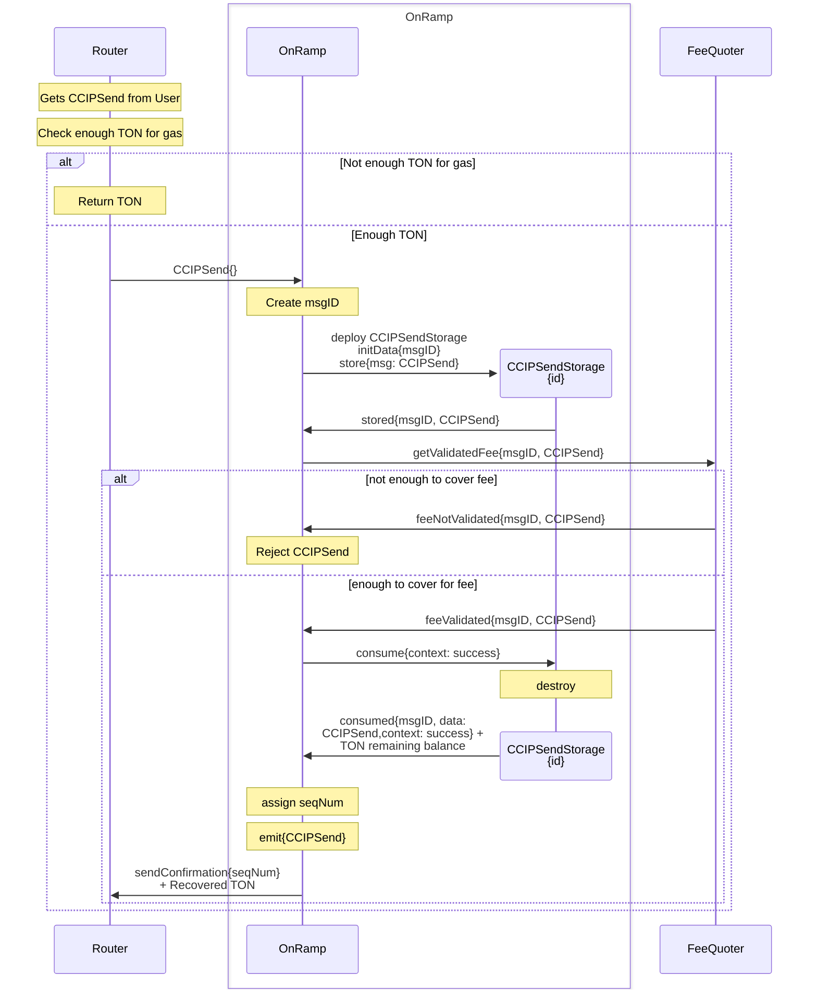
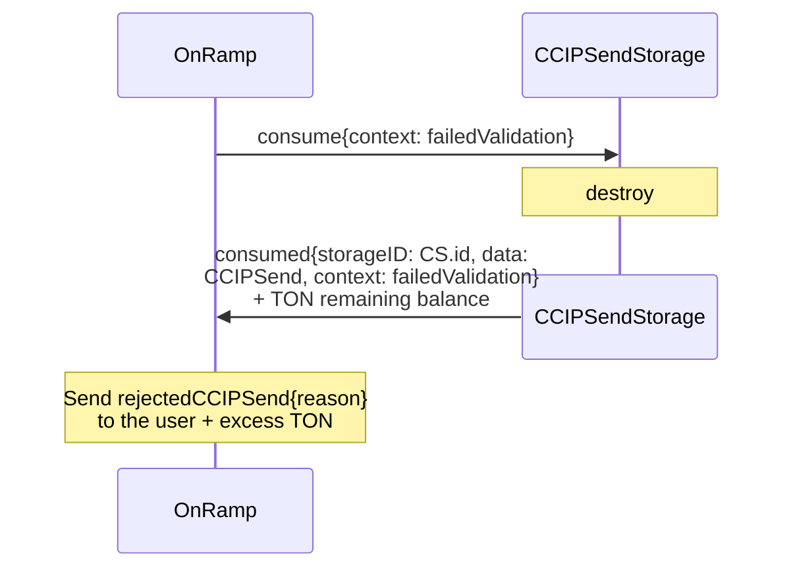
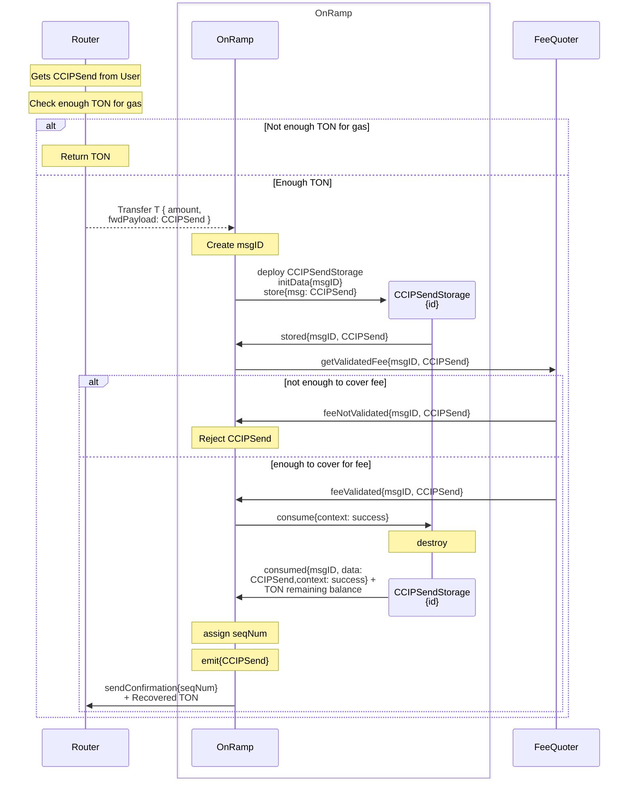

# Arbitrary Message Onramp Flow

> See [how CCIPSend works](../../contracts/ccip/onramp-ccipsend-storage.md) and [how the Token Registry is implemented](../../contracts/ccip/token-registry.md).

## Paid with TON

For any bounce we catch, or when we say Reject CCIPSend, it envolves:

## Paid with LINK

For any bounce we catch, or when we say Reject CCIPSend, it envolves:

