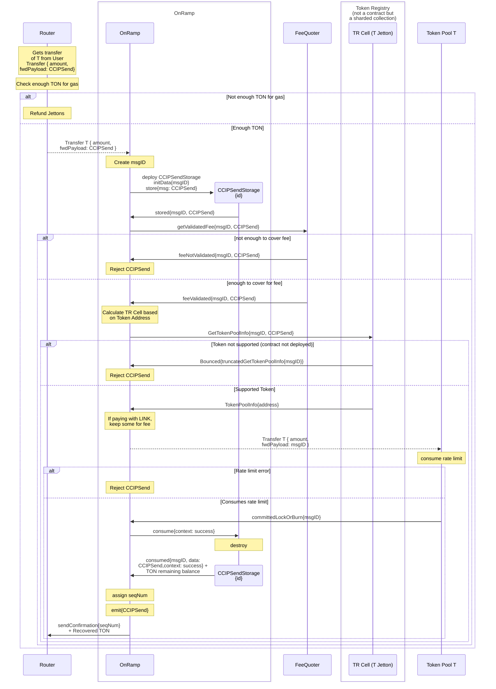
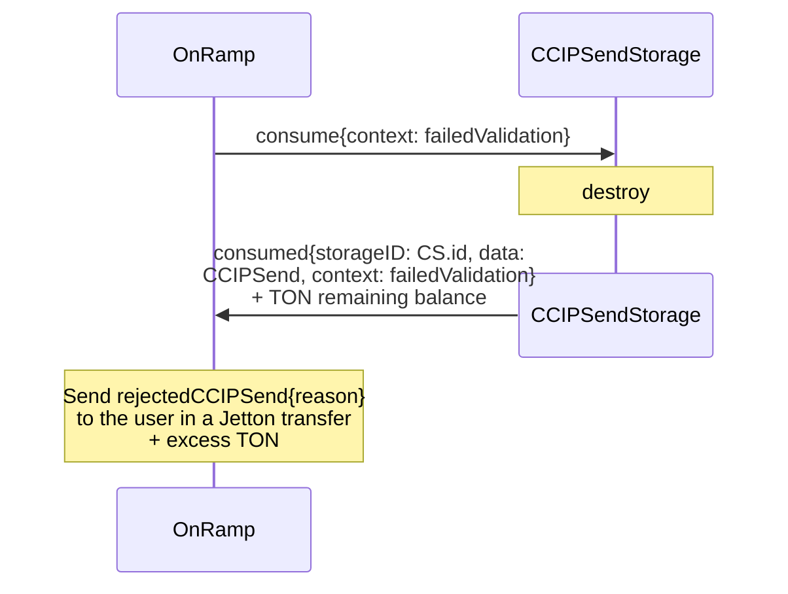

# Token Transfer Onramp Flow

> Before you read, see [Jetton Transfer Notation Convention](../token-transfer-notation-convention.md)

> See also [how CCIPSend works](../../contracts/ccip/onramp-ccipsend-storage.md) and [how the Token Registry is implemented](../../contracts/ccip/token-registry.md).

## Any token transfer paid in TON or LINK transfer paid in LINK

For any bounce we catch, or when we say Reject CCIPSend, it envolves:

