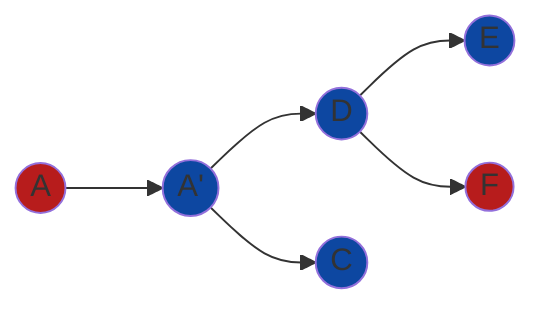

# Ton Utils Package

The `tonutils` package provides utilities for interacting with the TON blockchain, focusing on asynchronous communication and message tracing. It simplifies the process of sending messages, waiting for their reception, and recursively processing outgoing messages in the trace.

## Overview

TON's asynchronous model presents unique challenges. When a message is sent, its reception is processed in a transaction, which can be awaited. However, if the message generates outgoing messages, those new messages are not automatically awaited. This recursive tree of outgoing messages is called a **trace**. The `tonutils` package provides functions to send a message and wait for the entire trace to be processed.

### Message Trace Example



In this example:

- `A` is an external message that is sent to a wallet, which forwards it as an internal message `A'`.
- `A'` generates two outgoing messages: `D` and `C`.
- `D` generates two more outgoing messages: `E` and `F`, the latter being an external message (e.g. an **event**).

### Message lifecycle

In TON, a message has two states: sent and received. The node is considered received when it is settle on a transaction. Each transaction have one incomming message that can be external or internal, and a list of outgoing messages. Each of this outgoing messages have not been processed until they are received in a different transaction.

In this package, we will use three states for tracking message traces:

- Sent: When it has just been queues from a different transaction.
- Received: When they appear as an incomming mesage in a transaction, but none of its outgoing messages have been yet received.
- Cascading: When one or more of its outgoing messages have been received, but there is at least one that has not.
- Finalized: When it has no outgoing messages in the Sent state.

## Key Features

- **Send and Wait for Trace**: Ensures all outgoing messages in the trace are processed.
- **Message Mapping**: Maps incoming and outgoing messages to their respective transactions.
- **Fee Calculation**: Provides detailed breakdowns of fees, including storage fees, gas fees, and forwarding fees.

---

## Functions

### `SendAndWaitForTrace`

```go
func (ac *ApiClient) SendAndWaitForTrace(ctx context.Context, dstAddr address.Address, messageToSend *wallet.Message) (*ReceivedMessage, error)
```

**Description:**

Sends a message to the specified address and waits for the entire trace of outgoing messages to be processed recursively. Returns the resulting message in a `Finalized` state.

### `SubscribeToMessages`

```go
func (ac *ApiClient) SubscribeToMessages(address address.Address, lt uint64) chan *ReceivedMessage
```

**Description:**

Returns a channel with all incoming messages for the specified address that occurred after the given Lamport Time (LT). Works retroactively, providing both historical and new messages.

### `MapToReceivedMessage`

```go
func MapToReceivedMessage(txOnReceived *tlb.Transaction) (ReceivedMessage, error)
```

**Description:**

Maps a transaction to a `ReceivedMessage`, extracting its state, fees, and outgoing messages.

### `WaitForTrace`

```go
func (m *ReceivedMessage) WaitForTrace(ac *ApiClient) error
```

**Description:**

Waits for all outgoing messages in the trace to be received and recursively processes their outgoing messages. Returns the resulting message in a `Finalized` state.

### `VerifyTransaction`

## Fee Structure

The package provides detailed insights into the fees associated with transactions:

- **Storage Fee**: Charged to the receiver for storing the message.
- **Gas Fee**: Charged to the receiver for processing the message.
- **Forwarding Fee**: Charged to the sender for forwarding the message.
- **Action Fees**: Total fees charged during the action phase.

---

## Usage Example

Examples can be found at [this directory](../../pkg/tonutils/tests/async_communication/). Their documentation can be found [in this doc](../contracts/overview/examples/async-communication.md).
